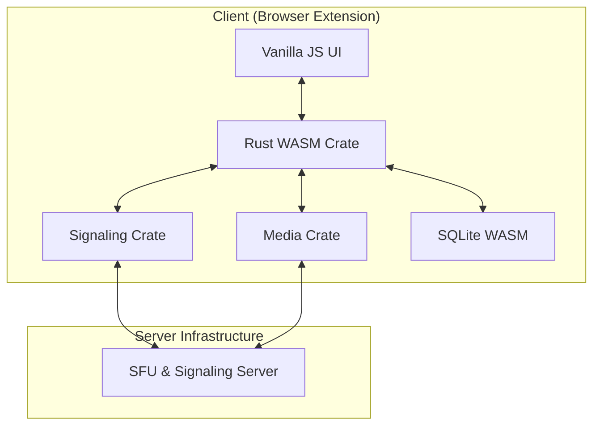

# System Architecture

The Rust Video Chat Extension is a high-performance, privacy-focused video conferencing solution built with Rust, WebAssembly, and WebRTC.

## High-Level Overview

## Core Components

### 1. crates/core
Contains shared configuration, error types, and the telemetry system. This is the foundation for all other crates.

### 2. crates/media
Handles WebRTC peer connection management and media stream logic. It abstracts the complexity of `webrtc-rs` for both client and server usage.

### 3. crates/signaling
Implements the WebSocket-based signaling protocol. It is used by both the client (extension) and the signaling server.

### 4. crates/wasm
The entry point for the browser extension. It uses `wasm-bindgen` to expose Rust functionality to JavaScript and handles local persistence via SQLite.

### 5. crates/sfu-server
The unified backend server that handles both WebSocket signaling (room management) and media routing (SFU). It routes media packets between participants without transcoding.

## Data Flow

1.  **Signaling**: Participants exchange SDP offers/answers and ICE candidates via the Signaling Server.
2.  **Media**: Once a connection is established, the Client sends media streams to the SFU, which then forwards them to other participants in the room.
3.  **Persistence**: Chat logs and room metadata are stored locally in the browser using SQLite via the Origin Private File System (OPFS).
